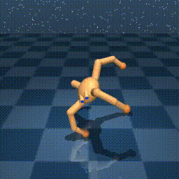

# ece567_project1

This project is based on the URLB benchmark (https://github.com/facebookresearch/controllable_agent.git), using two baselines, DIAYN and FB, across multiple environments, including cheetah, walker, quadruped, hopper, maze, and jaco. The environment setup differs between macOS (`MAC_requirements.txt`) and Ubuntu (`UBUNTU_requirements.txt`). We recommend running experiments on Ubuntu, as it provides GPU compatibility, supports video recording, and results in fewer dependency and library issues.

**Note**: Run `export MUJOCO_GL=glfw` for MuJoCo compatibility.

**Note**: For Ubunut compatibility 
```
sudo apt-get install -y libglfw3 libglew2.0 libgl1-mesa-glx libosmesa6
```

### Run Structure

Pretraining step

Agent = `diayn`, `fb_ddpg`
Task = enviroment_task
| Environment | Tasks |
|---|---|
| `walker` | `stand`, `walk`, `run`, `flip` |
| `quadruped` | `walk`, `run`, `stand`, `jump` |
| `cheetah` | `run`, `run_backward`, `walk`, `walk_backward` |
| `Hopper` | `hop`, `stand`, `jump`, `hop_backward` |
| `jaco` | `reach_top_left`, `reach_top_right`, `reach_bottom_left`, `reach_bottom_right` |
| `point_mass_maze` | `reach_top_left`, `reach_top_right`, `reach_bottom_left`, `reach_bottom_right` |

Replace in this example command
```
python -m url_benchmark.pretrain agent=diayn task=hopper_jump 
```

Online training

| Environment | Custom_reward |
|---|---|
| `walker` | `walker_position` |
| `quadruped` | `quadruped_position` |
| `cheetah` | `cheetah_speed` |

Replace in this example command
```
python -m url_benchmark.train_online agent=diayn task=quadruped_walk reward_free=false custom_reward=quadruped_position load_model="path.pt" save_video=True
```
Hiplot for Monitoring Training

From your device containing the logs
`python -m hiplot url_benchmark.simple_hiplogs.load --port=XXXX`

## Results

### DIAYN


### FB


Enviroment generation used by  Weijia
```
conda create -n RL2 python=3.8 ipython -y, conda activate RL2, conda install pytorch torchvision pytorch-cuda=11.8 -c pytorch -c nvidia -y, pip install "pip<24.1" "setuptools==65.5.0" "wheel==0.38.4", pip install --progress-bar off -r requirements.txt, export MUJOCO_GL=egl.
```
